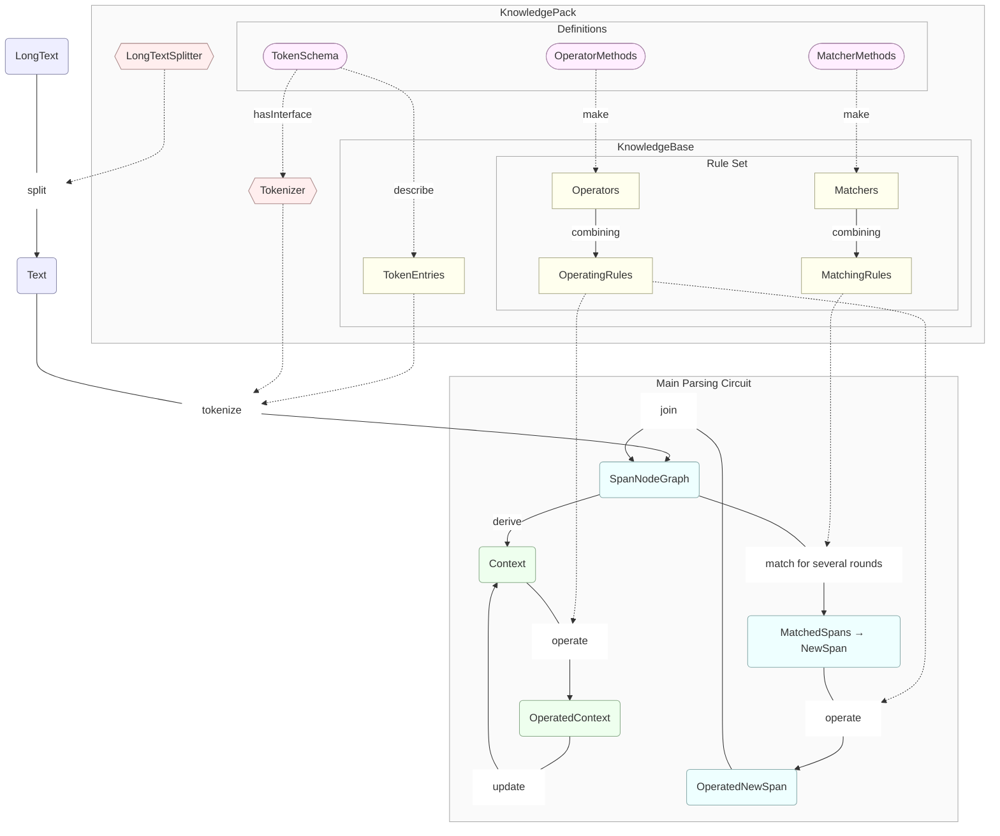

## NaturalParser 的工作原理




这个项目的主要功能是解析自然语言文本。它的工作流程可以分为几个主要部分：

1. **文本分割和标记化**：
   - 首先，输入的长文本（LongText）会被分割（split）成较小的文本片段（Text）。
   - 然后，这些文本片段会通过标记器（Tokenizer）进行标记化（tokenize），生成一个节点图（SpanNodeGraph）。
2. **知识包**：
   - 知识包（KnowledgePack）包含了多个模块和定义：
     - **长文本分割器（LongTextSplitter）**：负责将长文本分割成较小的片段。
     - **标记器（Tokenizer）**：负责将文本片段转化为标记。
     - **定义（Definitions）**：包括匹配方法（MatcherMethods）、操作方法（OperatorMethods）和标记模式（TokenSchema）。
     - **知识库（KnowledgeBase）**：包括标记条目（TokenEntries）和规则集（Rule Set），其中规则集包含匹配器（Matchers）、操作器（Operators）、匹配规则（MatchingRules）和操作规则（OperatingRules）。
3. **匹配和操作**：
   - 节点图（SpanNodeGraph）会通过匹配规则（MatchingRules）进行多轮匹配（match），生成新的节点（NewSpan）。
   - 新的节点会通过操作规则（OperatingRules）进行操作（operate），生成操作后的新节点（OperatedNewSpan）和操作后的上下文（OperatedContext）。
4. **更新和合并**：
   - 操作后的新节点和上下文会分别进行更新（update）和合并（join），最终形成一个完整的解析结果。


<!-- 


 -->


### 核心概念

#### 片段节点 SpanNode

**片段节点** SpanNode : 描述了文本中的一个片段所具有的各种属性。

例如，在“左脚向左跨出一步”中，第2个“左”字对应的 SpanNode 可以描述为：

```json
{ "start": 3, "end": 4,
  "text": "左", "length": 1,
  "details": {
    "tags": ["f", "fg", "fg-basic", "fg-3D", "fg-X-axis", "fg-X-left"] } }
```

#### 匹配器 Matcher

**匹配器** Matcher : 是用来匹配符合特定条件的 SpanNode 的工具。

例如，如果要匹配前面提到的“左脚向左跨出一步”中的“左”字对应的 SpanNode，可以使用如下匹配器：

```json
{ "method": "haveTag", "params": ["fg-X-left"] }

// or
{ "method": "haveTags", "params": [["f", "fg-X-axis"]] }

// or
{ "method": "textIs", "params": ["左"] }

// or
{ "method": "textLengthOp", "params": ["<", 3] }

// or
{ "method": "positionNotStart" }

// or
{ "method": "and", "params": [
  { "method": "haveTag", "params": ["fg-X-left"] },
  { "method": "textIs", "params": ["左"] },
  { "method": "none", "params": [[
    { "method": "positionIsStart" },
    { "method": "positionIsEnd" }
  ]] }
] }
```

#### 匹配规则 MatchingRule

**匹配规则** MatchingRule : 是由多个匹配器组合而成的规则，用来匹配一串连续的 SpanNodes 。


### 基本工作流程


### 本体的定义

#### 匹配方式 MMs

匹配方式（MatcherMethod）是在定义具体的匹配器时使用的

#### 操作方式 OMs

#### 词条规格 TokenSchema

### 词条库

### 规则库

#### 匹配规则

#### 操作规则

### 解析器

